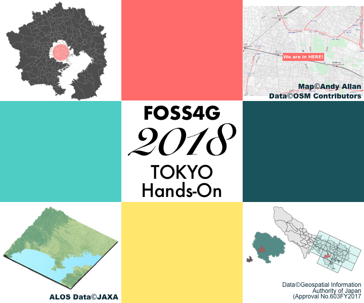

Rを用いた地理空間データの操作と可視化
=================

<p align="center"><b>FOSS4G 2018 TOKYO ハンズオン</b></p>

<p align="center"></p>

2018年11月9日(金曜日) 開催予定の[FOSS4G2018TOKYO](https://www.osgeo.jp/events/foss4g-2018/foss4g-2018-tokyo)ハンズオンの資料置き場です。

[](https://mybinder.org/v2/gh/uribo/foss4g-2018-tokyo/master?urlpath=rstudio)
[_-CC0-green.svg)](https://creativecommons.org/publicdomain/zero/1.0/)
[_-MIT-green.svg)](https://opensource.org/licenses/MIT)

### 概要

R言語を利用して、地理空間データを分析するために必要な操作・可視化の仕方を学びます。OpenStreetMap、気象庁や政府統計 e-Statなどの身近なデータを題材とし、多様なデータの表現、インタラクティブなデモンストレーションを実践的に行います。

### 受講対象者

地図とデータの可視化・分析に興味がある人。「黒い画面（端末）」に嫌悪感を抱かない人（少しだけ触れます）。
Rおよびモダンなパッケージ群であるtidyverse (https://www.tidyverse.org/) について幾らかの理解があると望ましいです。

### 事前準備

次の3つのアプリケーションがインストールされたノートパソコン（Wi-Fiに接続できること）。1. R (https://cran.r-project.org/), 2. RStudio (https://www.rstudio.com/), 3. Docker (https://www.docker.com/products/docker-desktop)。セッションを通して、Docker環境を利用します。Dockerをインストールし、docker-composeが利用可能なことを事前に確認していてください。
これらのアプリケーションのインストール方法を含めた詳細な内容、利用するソースコード等はこちらのリポジトリで公開します。


## 必要なもの

バージョンを確認ください。

* R (>=3.3.0)
* RStudio (>= 1.1.0)
* Docker
* docker-compose

### 各種サービスへの登録

ハンズオンの途中からでも登録可能ですが、事前にこれらのサービスへの登録を行っていただいていると、時間の短縮・自由にできることが増えます :)

- [ ] [政府統計の相談窓口 e-Stat](https://www.e-stat.go.jp)... データ利用のため
- [ ] 宇宙航空研究開発機構 (JAXA) が提供する [ALOS全球数値地表モデルデータセット](https://www.eorc.jaxa.jp/ALOS/aw3d30/index_j.htm) 利用のためのユーザ登録... データ利用のため
- [ ] [mapbox](https://www.mapbox.com/)... [deck.gl](http://deck.gl/)利用のため

## コードの実行

セッションを通してDocker環境を利用します。次のコマンドを実行し、`localhost:8787` へアクセスしてください。

``` bash
docker-compose up
```

docker-compose を利用しない場合

```bash
docker build -t foss4g_tokyo_r .
docker run --rm -v `pwd`:/home/rstudio/foss4g-2018-tokyo -p 127.0.0.1:8787:8787 -e DISABLE_AUTH=true foss4g_tokyo_r
```
